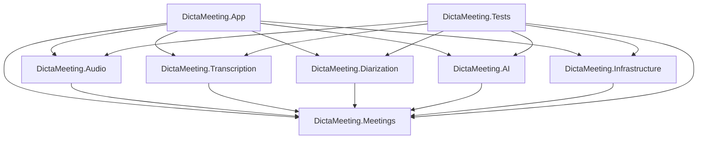

# DictaMeeting — System Architecture

**[🇬🇧 English](ARCHITECTURE.en.md) | [🇪🇸 Español](ARCHITECTURE.md)**

This document describes the technical design, modular structure, and architectural principles of **DictaMeeting**.

---

## 1. Overview and Design Principles

DictaMeeting is designed as a high-performance native Windows desktop application governed by the following architectural tenets:

1. **Strict Separation of Concerns**: The graphical user interface (UI) is completely decoupled from audio processing, transcription, diarization, and persistence logic.
2. **Inversion of Control & Dependency Injection (IoC / DI)**: All infrastructure, audio capture, and compute services communicate through clear interfaces (`IAudioCaptureService`, `ITranscriptionService`, `IDiarizationService`, etc.), enabling seamless component swapping and robust unit/integration testing with mocks.
3. **Local Privacy and Data Sovereignty**: No audio stream or transcribed fragment leaves the local machine during normal operations. Only when the user explicitly triggers "Generate Minutes" are the text transcript and meeting metadata sent over TLS to OpenRouter or a user-specified OpenAI-compatible server.
4. **Secret Security**: No plaintext configuration files or insecure environment variables are used for credentials. API keys are encrypted at rest using the Windows Data Protection API (DPAPI).
5. **CPU-First Performance**: Efficient buffer memory management in continuous audio streams (chunk-based streaming) and quantized neural models for fluid, real-time inference on standard x64 processors.

---

## 2. Project Map and Layering

```
DictaMeeting/
│
├── src/
│   ├── DictaMeeting.Meetings/         (Core domain: Models, Contracts, Exporters)
│   ├── DictaMeeting.Audio/            (WASAPI capture, Mixer, Limiter, VU meters)
│   ├── DictaMeeting.Transcription/    (ASR contracts, Model Manager, Chunks)
│   ├── DictaMeeting.Diarization/      (Acoustic diarization, Speaker reconciler)
│   ├── DictaMeeting.AI/               (OpenRouter client, Minutes generator, LLamaSharp)
│   ├── DictaMeeting.Infrastructure/   (DPAPI, Disk meeting repository, Logging)
│   ├── DictaMeeting.Launcher/         (Native Win32 launcher for clean console-less startup)
│   └── DictaMeeting.App/              (WPF, MVVM, DI Host, Modern styles, Views)
│
└── tests/
    └── DictaMeeting.Tests/            (Unit and integration test suite across all layers)
```

### Dependency Graph



---

## 3. Domain Model (`DictaMeeting.Meetings`)

The domain core has zero dependencies on external frameworks or UI libraries. It encapsulates:

- **`Meeting`**: Represents a complete meeting session (identifier, title, organizer, organization, timestamps/duration, path to compressed audio, participants, and transcript segments list).
- **`TranscriptSegment`**: Atomic transcribed utterance with timestamps (`StartTime`, `EndTime`), speaker technical identifier (`SpeakerId`), user-facing display name (`SpeakerDisplayName`), text content, and finality state (`IsFinal`).
- **`Speaker`**: Speaker entity maintaining a strict distinction between:
  - `SpeakerId`: Immutable technical identifier generated by the diarization engine (e.g. `SPEAKER_00`).
  - `DisplayName`: User-assigned human-readable name (e.g. `Aritz Villodas`).
  - `ColorHex`: Visual accent color for UI avatars and badges.
  - Metrics: Accumulated speaking duration and intervention count.
- **`MeetingState`**: Explicit finite state machine:
  - `Idle` → Standby, audio source configuration.
  - `Preparing` → Initializing audio devices and AI models.
  - `Recording` → Active capture, mixing, live transcription, and interim diarization.
  - `Processing` → Post-meeting processing (offline high-fidelity transcription and full-session diarization).
  - `Finalizing` → Writing disk artifacts and finalizing compressed audio.
  - `Completed` → Ready for review, search, export, and optional AI minutes generation.
  - `Error` → Controlled fault state with localized error reporting.

---

## 4. Audio Pipeline and Mixing (`DictaMeeting.Audio`)

Engineered to support both video conferences (Teams, Zoom, Meet, Slack) and in-person room meetings:

1. **Dual Simultaneous Capture**:
   - **System Stream**: Captures Windows speaker audio playback via `WASAPI Loopback Capture`.
   - **Microphone Stream**: Captures local voice input via `WASAPI Capture`.
2. **Independent Channel Control**: Either stream can be toggled on/off independently by the user.
3. **Normalization and Mixing**:
   - Conversion to a standardized format (16 kHz, 16-bit mono for ASR or stereo for output).
   - Soft clipping and saturation limiting (`tanh` curve) to prevent digital clipping when both sources produce high-amplitude signals simultaneously.
   - Balanced leveling to ensure remote participants never mask the local moderator's voice.
4. **Compressed Voice Recording**:
   - Mixed audio is streamed continuously into an efficient compressed audio format (MP3 / AAC at 64 kbps via Windows Media Foundation) to produce `audio.mp3`.

---

## 5. Transcription and Diarization Architecture

### Speech Recognition (`DictaMeeting.Transcription`)
- **`ITranscriptionService`**: Core abstraction defining streaming chunk processing (`TranscribeAudioChunkAsync`) and offline post-meeting batch processing (`TranscribeAudioFileAsync`).
- **Multi-Engine Architecture (`CompositeTranscriptionService`)**:
  - **Whisper Engine (`WhisperTranscriptionService`)**: High-accuracy offline model via `Whisper.net` and native AVX2 C++ runtimes (Tiny, Base, Small, Medium, Large-v3 Turbo).
  - **Qwen3-ASR Engine (`SherpaQwenTranscriptionService`)**: Modern engine based on `sherpa-onnx` and ONNX Runtime INT8 (**Qwen3-ASR 0.6B** and **Qwen3-ASR 1.7B**), specialized for technical software/IT jargon, mixed Spanglish, and resilience against silence hallucination loops.
- **`IModelManager`**: Unified catalog management across GGML binaries and `.tar.bz2` compressed ONNX model archives, hardware capability detection, and modular on-demand downloading/uninstallation.

### Speaker Diarization and Dynamic Renaming (`DictaMeeting.Diarization`)
- During the meeting: Reactive assignment of interim IDs (`SPEAKER_00`, `SPEAKER_01`).
- **Live In-Place Renaming**: When the user edits `SPEAKER_00` to "Aritz Villodas", the in-memory mapping `SpeakerId -> DisplayName` updates immediately. Past and future segments reflect the new name instantly across the UI without modifying raw audio IDs.
- **Final Reconciler**: Upon stopping the meeting, when the full-session acoustic diarizer refines speaker clusters, a temporal overlap algorithm (`ISpeakerReconciler`) automatically transfers user-assigned names to the final clusters with the highest correlation.

### Punctuation and Capitalization Restoration (`DictaMeeting.Transcription`)
- **`IPunctuationService`**: Decoupled contract for converting raw ASR output into natural text with commas, periods, and capitalization (`IsEnabled`, `RestorePunctuationAsync`).
- **`OnnxPunctuationService`**: Local CPU inference engine utilizing `Microsoft.ML.OnnxRuntime` and a multilingual fine-tuned XLM-RoBERTa-base INT8 model (`onnx-community/punctuate-all-ONNX`).
- **Native .NET Tokenization**: Built with `Microsoft.ML.Tokenizers.SentencePieceTokenizer` adapted with Fairseq mapping (+1 offset) for 100% offline compatibility without Python runtime dependencies.
- **Sliding Overlapping Windows**: Processes transcripts of arbitrary duration using up to 200-word windows with 30-word overlaps to preserve grammatical context without dropping or duplicating words.
- **Duplicate Punctuation Prevention**: Strips peripheral punctuation and applies regex sanitization to avoid collisions such as `..` or `,,`.
- **Default Disabled (`IsEnabled = false`)**: Because Qwen3-ASR natively produces semantic punctuation and capitalization in its generative decoder, this service is disabled by default in `MeetingProcessingService` to maintain verbatim transcript quality, while leaving the infrastructure ready for pure ASR models.

---

## 6. Artificial Intelligence (`DictaMeeting.AI`)

### 6.1 Post-Meeting Executive Minutes (`IAiActaService`)
- **`IAiActaService`**: Service communicating with OpenRouter or self-hosted OpenAI-compatible gateways.
- **Prompt Engineering**:
  - Strict anti-hallucination guardrails: conclusions must be grounded exclusively in the transcript.
  - Explicit bifurcation between "Agreed Decisions" vs. "Debated Proposals".
  - Action items structured table (Task, Assignee, Deadline).
  - Configurable parameters: Language (Spanish, English), Detail Level (Brief, Normal, Detailed, Exhaustive), and optional sections.

### 6.2 Embedded Live Meeting Summary (`ILiveSummaryService` / `llama.cpp`)
- **Goal**: Provide a concise running summary (2–4 lines) updated in real time during the meeting so participants can catch up at a glance.
- **100% Local & Embedded**:
  - Zero external dependencies: no Ollama, no LM Studio, no Docker, no Python, no external daemons.
  - Native C++ inference engine via **`LLamaSharp`** and **`llama.cpp`** running directly within the C# process.
  - Dynamic CPU instruction set detection (AVX2, AVX, AVX-512, or baseline) with optional NVIDIA GPU acceleration when available.
- **GGUF Model**:
  - **`Qwen2.5-1.5B-Instruct`** quantized in **`Q4_K_M`** (~986 MB). Delivers exceptional comprehension and synthesis in Spanish, English, and technical terminology with minimal RAM overhead (~1.1 GB total RAM with 2048-token context).
- **Sliding Window & Incremental Synthesis**:
  - Sliding context window of 60–90 seconds (default 75s) respecting segment boundaries.
  - Periodic synthesis every 30–60 seconds (default 35s), triggered only when at least 15 new words are spoken.
  - Cumulative update scheme: `PreviousSummary + NewWindow -> UpdatedSummary`, keeping the running summary concise and bounded.
- **Audio & ASR Priority Guard**:
  - LLM inference runs on a decoupled background thread (`Task.Run` with a single-concurrency semaphore), capping inference threads to `Environment.ProcessorCount / 2` (maximum 4 threads).
  - WASAPI audio capture, Silero VAD, and speech transcription maintain strict CPU priority to avoid dropped frames or stutter.
- **Automated Model Lifecycle**:
  - **`ILiveSummaryModelManager`**: Detection, transparent Hugging Face downloading with progress reporting, SHA256 verification, and storage in `%LocalAppData%\DictaMeeting\models\summary\`.

---

## 7. Internationalization and Localization (`DictaMeeting.App`)

DictaMeeting delivers a complete native bilingual experience (**English** and **Spanish**) through a decoupled, reactive localization architecture:

- **`LocalizationManager`**:
  - Central resource coordinator (`Strings.resx`, `Strings.es.resx`, `Strings.en.resx`).
  - **First-run automatic detection**: Inspects OS culture (`CultureInfo.CurrentUICulture.TwoLetterISOLanguageName`). If Spanish, UI defaults to Spanish; otherwise, it defaults to English.
  - **Runtime switching & persistence**: Users can toggle languages instantly from the top header selector. The selection persists in user configuration (`appsettings.json`).
  - **Reactive events**: Fires `LanguageChanged` notifications to update all UI elements instantly without application restarts.
- **`LocExtension`**:
  - Custom XAML markup extension (`{loc:Loc KeyName}`) providing dynamic data binding across WPF views and templates with design-time and runtime live updates.
- **Programmatic Localization and Dialogs**:
  - Alerts, validation notices, and dialogs (`MessageBox.Show`) query `LocalizationManager.GetString(key)` ensuring absolute consistency in both languages.

---

## 8. Model Management and Onboarding (`FirstRunModelsOnboardingWindow`)

DictaMeeting operates completely offline during meetings using local AI models. To manage their lifecycle:

- **Configurable Models Directory**:
  - Default path: `%LocalAppData%\DictaMeeting\models\`.
  - Configurable storage path allowing users to move heavy neural models to secondary drives or SSD partitions.
- **`IModelManager` & `ILiveSummaryModelManager`**:
  - Model status tracking (Not Downloaded, Downloading, Ready, Verifying SHA256).
  - Resilient asynchronous downloads with percentage progress, ETA, and cancellation support (`CancellationToken`).
- **`FirstRunModelsOnboardingWindow` (Onboarding Wizard)**:
  - On the very first launch, if no models are detected, a clean onboarding window welcomes the user.
  - Offers a one-click download for baseline models (Silero VAD + Qwen3-ASR 0.6B for low-latency live transcription and lightweight diarization).
  - Users can skip the wizard and configure models manually at any time in the Settings view.

---

## 9. Two-Phase Transcription Pipeline: Live vs. Final

DictaMeeting employs a complementary two-phase hybrid pipeline:

### Phase 1: Live Flow (Real-Time)
1. **Capture & VAD**: Audio acquired via WASAPI (microphone and/or loopback) is buffered and filtered in real time with **Silero VAD v5** to isolate clean speech segments.
2. **Continuous ASR**: Speech chunks stream to the selected engine (**Qwen3-ASR 0.6B/1.7B** or Whisper) producing interim transcripts with sub-2-second latency.
3. **Interim Diarization**: Rapid acoustic clustering assigns provisional speaker tags (`SPEAKER_00`, etc.) with instant UI display.
4. **Decoupled Live Summary**: The embedded `llama.cpp` service analyzes rolling transcript windows and updates a running summary card without impacting audio capture threads.

### Phase 2: Final Flow (Post-Meeting Processing)
1. **Audio Consolidation**: The unified audio stream is finalized and closed (`audio.mp3`).
2. **Full-Session Diarization**: Global diarization runs across the full recording (PyAnnote Community-1 or global acoustic clustering) to resolve overlaps and refine speaker counts.
3. **Speaker Name Reconciliation**: `ISpeakerReconciler` transfers user-assigned names to the final clusters based on temporal alignment.
4. **Punctuation Restoration (Optional)**: If using unpunctuated ASR models, `OnnxPunctuationService` normalizes capitalization and punctuation.
5. **Session Persistence**: All session artifacts are written to disk.

---

## 10. Persistence, Secure Storage, and Privacy (`DictaMeeting.Infrastructure`)

### Meeting Storage Layout
Each meeting session is stored in a self-contained, portable folder without database dependencies:
```
Meetings/
  2026-09-21_Project-Review-Meeting/
      meeting.json       (Complete metadata, participants, and timestamped segments)
      transcript.md      (Clean Markdown transcript)
      transcript.txt     (Plaintext transcript)
      audio.mp3          (Compressed audio recording)
      acta.md            (AI-generated meeting minutes, if requested)
```

### Credential Protection
- API keys for OpenRouter or custom OpenAI-compatible endpoints are encrypted at rest using Windows DPAPI:
  `ProtectedData.Protect(bytes, entropy, DataProtectionScope.CurrentUser)`.
- No plaintext keys exist on disk or in exportable config files.
- Full custom endpoint support: Connect to OpenRouter, LiteLLM, vLLM, Ollama, LM Studio, or private enterprise servers.
