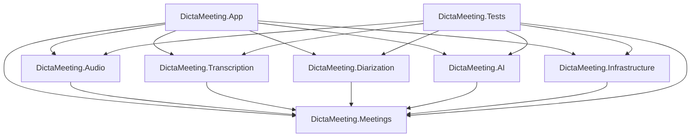

# DictaMeeting — Arquitectura del Sistema

**[🇪🇸 Español](ARCHITECTURE.md) | [🇬🇧 English](ARCHITECTURE.en.md)**

Este documento describe el diseño técnico, la estructura modular y los principios arquitectónicos de **DictaMeeting**.

---

## 1. Visión General y Principios de Diseño

DictaMeeting está diseñado como una aplicación de escritorio Windows nativa de alto rendimiento con las siguientes directrices arquitectónicas:

1. **Separación Estricta de Responsabilidades**: La interfaz gráfica (UI) está totalmente desacoplada de la lógica de procesamiento de audio, transcripción, diarización y persistencia.
2. **Inversión de Dependencias (IoC / DI)**: Todos los servicios de infraestructura, captura y computación se comunican mediante interfaces (`IAudioCaptureService`, `ITranscriptionService`, `IDiarizationService`, etc.), lo que permite intercambiar implementaciones o mockearlas para pruebas automatizadas.
3. **Privacidad y Soberanía Local**: Ningún stream de audio ni fragmento de transcripción abandona el equipo local. Únicamente cuando el usuario pulsa deliberadamente "Generar Acta", la transcripción de texto y los metadatos se transmiten vía TLS hacia el proveedor OpenRouter o servidor compatible.
4. **Seguridad de Secretos**: No se utilizan archivos de texto plano ni variables de entorno inseguras para credenciales. Las API keys se cifran con la API de Protección de Datos de Windows (DPAPI).
5. **Rendimiento en CPU**: Manejo eficiente de memoria en buffers de audio continuos (streaming por bloques) y modelos cuantizados para inferencia fluida en procesadores x64 estándar.

---

## 2. Mapa de Proyectos y Capas

```
DictaMeeting/
│
├── src/
│   ├── DictaMeeting.Meetings/         (Dominio central: Modelos, Contratos, Exporters)
│   ├── DictaMeeting.Audio/            (Captura WASAPI, Mezclador, Limitador, Vúmetros)
│   ├── DictaMeeting.Transcription/    (Contratos ASR, Gestor de Modelos, Chunks)
│   ├── DictaMeeting.Diarization/      (Diarización, Reconciliación de Speakers)
│   ├── DictaMeeting.AI/               (Cliente OpenRouter, Generador de Actas)
│   ├── DictaMeeting.Infrastructure/   (DPAPI, Repositorio de Reuniones en Disco, Logs)
│   ├── DictaMeeting.Launcher/         (Lanzador Win32 nativo para arranque limpio sin consola)
│   └── DictaMeeting.App/              (WPF, MVVM, DI Host, Estilos Modernos, Views)
│
└── tests/
    └── DictaMeeting.Tests/            (Tests unitarios y de integración para todas las capas)
```

### Relación de Dependencias



---

## 3. Modelo de Dominio (`DictaMeeting.Meetings`)

El núcleo del dominio no depende de bibliotecas externas ni de la UI. Contiene:

- **`Meeting`**: Representa una sesión de reunión completa (identificador, título, organizador, empresa, fechas/duración, ruta del audio comprimido, participantes y lista de segmentos de transcripción).
- **`TranscriptSegment`**: Unidad mínima de texto transcrito con marcas de tiempo (`StartTime`, `EndTime`), identificador de hablante (`SpeakerId`), nombre visible (`SpeakerDisplayName`), texto y estado (`IsFinal`).
- **`Speaker`**: Entidad de hablante que distingue estrictamente entre:
  - `SpeakerId`: Identificador técnico inmutable generado por el algoritmo de diarización (ej. `SPEAKER_00`).
  - `DisplayName`: Nombre asignado por el usuario (ej. `Aritz Villodas`).
  - `ColorHex`: Color identificativo para la visualización en la UI.
  - Estadísticas: tiempo acumulado de habla y número de intervenciones.
- **`MeetingState`**: Máquina de estados explícita:
  - `Idle` → En reposo, configuración de fuentes.
  - `Preparing` → Inicializando dispositivos y modelo.
  - `Recording` → Captura activa, mezcla, transcripción y diarización provisional.
  - `Processing` → Procesamiento post-reunión (transcripción y diarización definitiva).
  - `Finalizing` → Guardado de archivos y compresión de audio.
  - `Completed` → Reunión lista para revisión, exportación y generación opcional de acta.
  - `Error` → Estado controlado de fallo con mensaje amigable para el usuario.

---

## 4. Pipeline de Audio y Mezcla (`DictaMeeting.Audio`)

Para soportar tanto videoconferencias (Teams, Zoom, Meet) como reuniones presenciales:

1. **Captura Dual**:
   - **Stream Sistema**: Captura del audio reproducido en Windows mediante `WASAPI Loopback`.
   - **Stream Micrófono**: Captura de la entrada de voz mediante `WASAPI Capture`.
2. **Control de Flujos Independientes**: Cada flujo puede habilitarse/deshabilitarse individualmente por el usuario.
3. **Normalización y Mezcla**:
   - Conversión a formato unificado (16 kHz, 16-bit mono para ASR o estéreo según salida).
   - Control de saturación (Soft Clipper / Limiter) para evitar clipping si ambas fuentes emiten señales altas simultáneamente.
   - Nivelación balanceada para garantizar que el loopback no oculte la voz del moderador en el micrófono.
4. **Grabación Comprimida**:
   - El audio mezclado se codifica directamente en un formato eficiente (Opus / MP3) hacia el archivo final de la reunión (`audio.mp3` o `audio.opus`).

---

## 5. Arquitectura de Transcripción y Diarización

### Transcripción (`DictaMeeting.Transcription`)
- **`ITranscriptionService`**: Abstracción que define métodos para procesamiento por fragmentos en streaming (`TranscribeAudioChunkAsync`) y procesamiento completo post-reunión (`TranscribeAudioFileAsync`).
- **Arquitectura Multi-Motor (`CompositeTranscriptionService`)**:
  - **Motor Whisper (`WhisperTranscriptionService`)**: Motor clásico C++ empaquetado mediante `Whisper.net` (modelos: Tiny, Base, Small, Medium, Large-v3 Turbo).
  - **Motor Qwen3-ASR (`SherpaQwenTranscriptionService`)**: Motor moderno basado en `sherpa-onnx` y ONNX Runtime INT8 (modelos: **Qwen3-ASR 0.6B** y **Qwen3-ASR 1.7B**), optimizado para jerga técnica de software/IT, mezclas spanglish e inmunidad a bucles de repetición en silencios.
- **`IModelManager`**: Gestión unificada de catálogo multiformato (archivos binarios GGML y paquetes de modelos ONNX comprimidos en `.tar.bz2`), detección de capacidades de hardware y descarga/eliminación modular bajo demanda.

### Diarización y Reconciliación (`DictaMeeting.Diarization`)
- Durante la reunión: asignación reactiva de IDs provisionales (`SPEAKER_00`, `SPEAKER_01`).
- **Renombrado en caliente**: Cuando el usuario escribe "Aritz Villodas" para `SPEAKER_00`, la colección en memoria actualiza el mapeo `SpeakerId -> DisplayName`. Todos los segmentos pasados y futuros reflejan el nuevo nombre inmediatamente en la UI sin reescribir los IDs de audio.
- **Reconciliación definitiva**: Al finalizar la reunión, si la diarización global refina la separación de hablantes, un algoritmo de superposición temporal (`ISpeakerReconciler`) transfiere los nombres asignados por el usuario a los clusters finales con mayor grado de coincidencia.

### Restauración de Puntuación y Capitalización (`DictaMeeting.Transcription`)
- **`IPunctuationService`**: Contrato desacoplado para transformar texto en transcripciones fluidas con puntuación y mayúsculas (`IsEnabled`, `RestorePunctuationAsync`).
- **`OnnxPunctuationService`**: Motor de inferencia local en CPU basado en `Microsoft.ML.OnnxRuntime` y el modelo fine-tuned multilingüe XLM-RoBERTa-base INT8 (`onnx-community/punctuate-all-ONNX`).
- **Tokenización Nativa .NET**: Implementada con `Microsoft.ML.Tokenizers.SentencePieceTokenizer` adaptada con mapeo Fairseq (+1 offset) para compatibilidad total offline sin dependencias de Python.
- **Ventanas Deslizantes con Solapamiento**: Procesa reuniones de cualquier longitud dividiendo el texto en ventanas de hasta 200 palabras con 30 palabras de solapamiento para mantener contexto gramatical sin perder ni duplicar palabras.
- **Prevención de Puntuación Duplicada**: Tratamiento de palabras base con eliminación de puntuación periférica previa y sanitización regex que previene colisiones como `..` o `,,`.
- **Desactivación por Defecto (`IsEnabled = false`)**: Dado que Qwen3-ASR genera nativamente puntuación y capitalización semántica en su decodificador generativo, el servicio está desactivado por defecto en `MeetingProcessingService` para preservar intacta la transcripción original de alta calidad, dejando la infraestructura lista para activarse o adoptar futuros modelos ONNX.

---

## 6. Inteligencia Artificial (`DictaMeeting.AI`)

### 6.1 Generación de Actas Post-Reunión (`IAiActaService`)
- **`IAiActaService`**: Servicio para comunicarse con OpenRouter mediante API HTTP compatible con OpenAI.
- **Estructuración del Prompt**:
  - Instrucciones anti-alucinación rigurosas: fundamentar conclusiones exclusivamente en el texto transcrito.
  - Separación explícita de "Decisiones acordadas" vs "Propuestas debatidas".
  - Generación de tablas estructuradas de tareas (Acción, Responsable, Plazo).
  - Parámetros de personalización: Idioma (Español, English), Nivel de detalle (Breve, Normal, Detallada, Exhaustiva) y secciones optativas.

### 6.2 Resumen en Vivo de la Reunión (`ILiveSummaryService` / `llama.cpp`)
- **Objetivo**: Proveer un resumen provisional conciso (2–4 líneas) en tiempo real mientras transcurre la reunión para recuperar el hilo de la conversación sin leer toda la transcripción acumulada.
- **Ejecución 100% Local y Embebida**:
  - Cero dependencias externas: sin Ollama, sin LM Studio, sin Docker, sin Python ni servidores locales.
  - Motor de inferencia nativo C++ vía **`LLamaSharp`** y **`llama.cpp`** integrado en el proceso C#.
  - Detección dinámica y selección automática de runtime optimizado de CPU (AVX2, AVX, AVX-512 o no-AVX) con soporte opcional para GPU NVIDIA si está disponible.
- **Modelo GGUF**:
  - **`Qwen2.5-1.5B-Instruct`** cuantizado en **`Q4_K_M`** (~986 MB). Excelente comprensión y generación en español, inglés y mezclas técnicas con consumo de memoria contenido (~1.1 GB en RAM total con contexto de 2048 tokens).
- **Ventana Deslizante y Resumen Acumulativo**:
  - Ventana de contexto deslizante de 60–90 segundos (por defecto 75s) que preserva límites completos de segmentos de transcripción.
  - Generación periódica cada 30–60 segundos (por defecto 35s) activada únicamente si han ingresado al menos 15 palabras nuevas.
  - Esquema acumulativo: `ResumenAnterior + NuevaVentana -> ResumenActualizado`, manteniendo el resumen siempre breve y sin crecer indefinidamente.
- **Prioridad Absoluta de Audio y ASR**:
  - La inferencia del LLM corre en un hilo de fondo desacoplado (`Task.Run` con semáforo de concurrencia única), limitando los hilos de inferencia a `Environment.ProcessorCount / 2` (máx. 4 hilos).
  - Captura WASAPI, Silero VAD y Qwen3-ASR mantienen prioridad total de CPU sin sufrir interrupciones ni caídas de frames.
- **Gestión Automática del Modelo**:
  - **`ILiveSummaryModelManager`**: Detección, descarga transparente desde Hugging Face con barra de progreso, validación de integridad y almacenamiento en `%LocalAppData%\DictaMeeting\models\summary\`.

---

## 7. Internacionalización y Localización (`DictaMeeting.App`)

DictaMeeting soporta una experiencia bilingüe nativa completa (**Español** e **Inglés**) mediante una arquitectura de localización desacoplada y reactiva:

- **`LocalizationManager`**:
  - Núcleo central de gestión de idioma y recursos (`Strings.resx`, `Strings.es.resx`, `Strings.en.resx`).
  - **Detección automática en primer inicio**: detecta la cultura del sistema operativo del usuario (`CultureInfo.CurrentUICulture.TwoLetterISOLanguageName`). Si el sistema está configurado en español (es-ES, es-MX, etc.), la interfaz se inicia en Español; para cualquier otro idioma, utiliza Inglés de forma predeterminada.
  - **Selección manual y persistencia**: el usuario puede alternar el idioma en cualquier momento desde el selector de la barra superior. La selección se persiste localmente en la configuración del usuario (`appsettings.json`).
  - **Notificación reactiva**: emite eventos `LanguageChanged` que actualizan instantáneamente todos los textos de la interfaz sin requerir reiniciar la aplicación.
- **`LocExtension`**:
  - Extensión de marcado XAML (`MarkupExtension`) personalizada (`{loc:Loc KeyName}`) que permite enlazar textos dinámicamente en vistas y plantillas WPF con actualización reactiva en tiempo de diseño y ejecución.
- **Localización programática y cuadros de diálogo**:
  - Las alertas, errores y cuadros de diálogo (`MessageBox.Show`, validaciones) consumen `LocalizationManager.GetString(key)` garantizando consistencia absoluta en ambos idiomas.

---

## 8. Gestión de Modelos y Asistente de Inicio (`FirstRunModelsOnboardingWindow`)

DictaMeeting opera sin requerir conexión a internet obligatoria durante las reuniones, apoyándose en modelos de IA locales. Para gestionar su ciclo de vida:

- **Directorio de Modelos Configurable**:
  - Ubicación por defecto: `%LocalAppData%\DictaMeeting\models\`.
  - El usuario puede reubicar el directorio de almacenamiento de modelos desde la configuración a otra unidad o partición.
- **`IModelManager` y `ILiveSummaryModelManager`**:
  - Supervisión del estado de cada modelo (No descargado, Descargando, Descargado, Verificando integridad SHA256).
  - Descargas asíncronas con reporte de progreso porcentual, estimación de tiempo y soporte de cancelación (`CancellationToken`).
- **`FirstRunModelsOnboardingWindow` (Asistente de Primer Inicio)**:
  - En el primer arranque de la aplicación tras la instalación, si no se detectan modelos descargados, se presenta un asistente amigable de bienvenida y configuración de modelos.
  - Permite descargar con un solo clic el conjunto recomendado (Silero VAD + Qwen3-ASR 0.6B para transcripción en tiempo real y diarización ligera).
  - El usuario puede omitir el asistente y gestionar los modelos posteriormente desde la pantalla de configuración.

---

## 9. Flujo de Transcripción en Dos Fases: Live vs. Final

DictaMeeting implementa un pipeline híbrido en dos fases complementarias:

### Fase 1: Flujo en Vivo (Live Flow)
1. **Captura y VAD**: El audio capturado por WASAPI (micrófono y/o loopback de sistema) se bufferiza y analiza en tiempo real con **Silero VAD v5** para detectar segmentos de voz limpia.
2. **Transcripción Continua**: Los bloques de audio se envían al motor ASR seleccionado (típicamente **Qwen3-ASR 0.6B/1.7B** o Whisper) generando texto provisional con latencia inferior a 1–2 segundos.
3. **Diarización Provisional**: Asignación reactiva de identificadores de hablante (`SPEAKER_00`, etc.) y actualización visual instantánea.
4. **Resumen en Vivo Desacoplado**: El servicio embebido `llama.cpp` analiza ventanas deslizantes de la transcripción y actualiza periódicamente un resumen conciso sin interferir en la prioridad de la captura de audio.

### Fase 2: Flujo Final Post-Reunión (Processing Flow)
1. **Consolidación de Audio**: El archivo unificado de audio (`audio.mp3`) se finaliza y cierra.
2. **Re-análisis de Diarización**: Ejecución del pipeline de diarización global (clustering sobre embeddings de hablantes o PyAnnote Community-1) para resolver solapamientos y refinar el número exacto de participantes.
3. **Reconciliación de Nombres**: `ISpeakerReconciler` transfiere los nombres asignados manualmente por el usuario a los clusters finales.
4. **Restauración de Puntuación (Opcional)**: En caso de utilizar modelos Whisper puros o sin puntuación, `OnnxPunctuationService` normaliza las mayúsculas y signos de puntuación.
5. **Persistencia Autónoma**: Se escriben todos los artefactos de la reunión en disco.

---

## 10. Persistencia, Almacenamiento Seguro y Privacidad (`DictaMeeting.Infrastructure`)

### Estructura de Almacenamiento de Reuniones
Cada sesión se guarda en una carpeta autónoma, portable y sin dependencias de bases de datos externas:
```
Meetings/
  2026-09-21_Reunion-Proyecto-X/
      meeting.json       (Metadatos completos, participantes y segmentos con timestamps)
      transcript.md      (Transcripción en Markdown limpio)
      transcript.txt     (Transcripción en texto plano)
      audio.mp3          (Grabación comprimida de la reunión)
      acta.md            (Acta generada con IA, si fue solicitada)
```

### Seguridad de Credenciales
- La clave de API para OpenRouter o proveedores compatibles se almacena cifrada a nivel de usuario en Windows mediante la API DPAPI:
  `ProtectedData.Protect(bytes, entropy, DataProtectionScope.CurrentUser)`.
- No existe almacenamiento en texto plano ni en ficheros de configuración exportables.
- Compatibilidad con endpoints personalizados: permite conectar tanto a OpenRouter como a servidores locales o gateways OpenAI-compatibles (LiteLLM, vLLM, Ollama, LM Studio).

