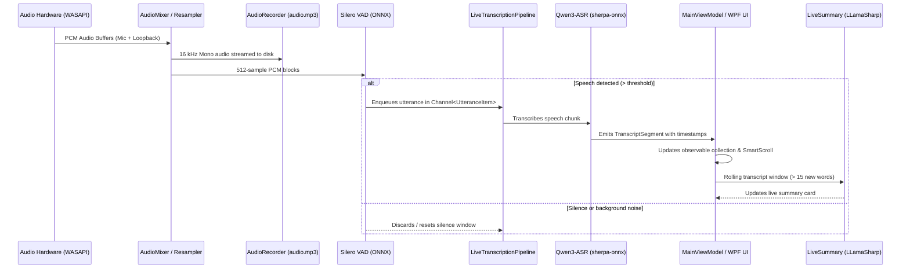

# DictaMeeting 🎙 — Developer Guide & Technical Reference

**[🇬🇧 English](DEVELOPER_GUIDE.en.md) | [🇪🇸 Español](DEVELOPER_GUIDE.md)**

This guide provides comprehensive technical documentation for developers, contributors, and software engineers looking to build, extend, or audit **DictaMeeting**.

---

## 🛠 1. Development Environment & Prerequisites

- **Operating System**: Windows 10 (Build 1809+) or Windows 11 x64.
- **SDK**: [.NET 9.0 SDK](https://dotnet.microsoft.com/download/dotnet/9.0) (x64 edition).
- **Recommended IDE**:
  - Visual Studio 2022 (version 17.12 or later) with the *.NET Desktop Development* workload.
  - Visual Studio Code with the *C# Dev Kit* and *.NET Install Tool* extensions.
- **Optional Tools**:
  - [Inno Setup 6](https://jrsoftware.org/isdl.php) (to compile the `.exe` desktop installer).
  - Git for version control.

---

## 📂 2. Project Architecture & Responsibilities

The `DictaMeeting.sln` solution consists of 9 decoupled projects:

| Project | Project Type | Technical Responsibility |
|---|---|---|
| `DictaMeeting.Meetings` | Class Library (`net9.0`) | **Domain Core**: Core entities (`Meeting`, `Speaker`, `TranscriptSegment`), export contracts, and serialization utilities (Markdown, Plain Text, JSON). Zero third-party dependencies. |
| `DictaMeeting.Audio` | Class Library (`net9.0-windows`) | **Capture & Mixing**: WASAPI services via NAudio, dual audio capture (microphone + loopback), 16 kHz mono resampling, soft-limiting limiter, and VU metering. |
| `DictaMeeting.Transcription` | Class Library (`net9.0-windows`) | **ASR & VAD Engines**: Implementations for Silero VAD v5, Qwen3-ASR (`sherpa-onnx`), Whisper (`Whisper.net`), model download managers, and ONNX punctuation restoration. |
| `DictaMeeting.Diarization` | Class Library (`net9.0-windows`) | **Speaker Diarization**: Acoustic feature extraction, online streaming clustering, offline batch diarization, and speaker reconciliation (`SpeakerReconciler`). |
| `DictaMeeting.AI` | Class Library (`net9.0-windows`) | **AI Services**: HTTP clients for OpenRouter and OpenAI-compatible gateways, minutes generation, and embedded local running summaries via `LLamaSharp` / `llama.cpp`. |
| `DictaMeeting.Infrastructure` | Class Library (`net9.0-windows`) | **Infrastructure & Security**: Windows DPAPI encryption (`ProtectedData`), disk meeting repository, and user settings persistence. |
| `DictaMeeting.Launcher` | WinExe C++ / Win32 (`net9.0-windows`) | **Native Launcher**: Ultra-lightweight Win32 bootstrap process that launches the WPF application without creating an unwanted console window. |
| `DictaMeeting.App` | WPF Application (`net9.0-windows`) | **Presentation Layer**: XAML views, ViewModels using `CommunityToolkit.Mvvm`, dependency injection host, modern obsidian themes, and reactive i18n system. |
| `DictaMeeting.Tests` | xUnit Test Project (`net9.0-windows`) | **Test Suite**: Unit, integration, and diagnostic test suites covering all system layers. |

---

## 🏗 3. Core Service Interfaces

All services are registered with the dependency injection container (`IServiceCollection`) in `DictaMeeting.App/App.xaml.cs`:

### Audio Services (`DictaMeeting.Audio`)
- `IAudioCaptureService`: Controls starting, pausing, and stopping WASAPI microphone and system loopback streams.
- `IAudioDeviceService`: Enumerates available Windows audio input/output devices and detects hot-plug changes.
- `IAudioMixerService`: Blends dual 16-bit floating-point PCM channels, levels signals, and prevents clipping via soft compression.
- `IAudioRecorderService`: Encodes the mixed audio stream into `audio.mp3` using Windows Media Foundation.

### Speech Recognition & VAD (`DictaMeeting.Transcription`)
- `ITranscriptionService`: Primary speech-to-text contract:
  - `TranscribeAudioChunkAsync(float[] samples, CancellationToken ct)`: Real-time chunked streaming transcription.
  - `TranscribeAudioFileAsync(string audioFilePath, ...)`: Offline high-fidelity batch transcription over the finalized audio recording.
- `IVoiceActivityDetector`: Analyzes 512-sample PCM windows and computes human voice probability (`0.0` to `1.0`).
- `IPunctuationService`: Restores periods, commas, and sentence capitalization for unpunctuated ASR engines.
- `IModelManager`: Manages the model catalog, validates SHA256 integrity, and handles downloads with progress events.

### Speaker Diarization (`DictaMeeting.Diarization`)
- `IDiarizationService`: Clusters acoustic features in real time, assigning speaker IDs (`SPEAKER_00`, `SPEAKER_01`).
- `ISpeakerReconciler`: Transfers user-assigned names to final full-session clusters using temporal overlap correlation.

### Artificial Intelligence (`DictaMeeting.AI`)
- `IAiActaService`: Communicates with OpenRouter or OpenAI-compatible local gateways (Ollama, LiteLLM) to generate structured executive minutes.
- `ILiveSummaryService`: Runs periodic local inference over rolling 60–90 second transcript windows using `llama.cpp` and `Qwen2.5-1.5B-Instruct-Q4_K_M.gguf`.

### Security & Infrastructure (`DictaMeeting.Infrastructure`)
- `ISecureStorageService`: Encrypts and decrypts credentials using Windows DPAPI (`DataProtectionScope.CurrentUser`).
- `IMeetingRepository`: Handles atomic persistence and retrieval of meeting sessions (`meeting.json`, `transcript.md`, `transcript.txt`).

---

## 🔄 4. Data Flow & Concurrency Architecture

Meeting processing relies on decoupled asynchronous channels (`System.Threading.Channels`):



### Thread Priority Management
1. **Real-Time Priority**: WASAPI buffers and audio resampling run on dedicated real-time audio threads to avoid sample dropouts.
2. **Normal Priority**: Speech recognition processes items from the asynchronous queue in background worker tasks (`Task.Run`).
3. **Throttled Background Priority**: Embedded LLM summary inference is capped to `Environment.ProcessorCount / 2` (maximum 4 threads) to prevent CPU contention with speech recognition.

---

## 🌐 5. Internationalization (i18n) Architecture

DictaMeeting delivers runtime bilingual localization (**English** and **Spanish**) without requiring application restarts:

### Resource Layout
- `src/DictaMeeting.App/Resources/Strings.resx`: Neutral default fallback resource.
- `src/DictaMeeting.App/Resources/Strings.es.resx`: Spanish translations.
- `src/DictaMeeting.App/Resources/Strings.en.resx`: English translations.

### Using Localization in XAML
Employ the custom `{loc:Loc KeyName}` markup extension:
```xml
<TextBlock Text="{loc:Loc Meeting_StartButton}" />
<Button ToolTip="{loc:Loc Meeting_Title_Save_Tooltip}" />
```

### Using Localization in C#
Inject `LocalizationManager` or use ViewModel helper methods:
```csharp
// Simple string lookup:
string title = _localizationManager.GetString("Dialog_Error_Title");

// Formatted composite string with arguments:
string message = _localizationManager.GetStringFormatted("Meeting_Exported_Success", filePath);
```

### Adding New Localization Keys
1. Add the key and fallback string to `Strings.resx`.
2. Add the corresponding translations to `Strings.es.resx` and `Strings.en.resx`.
3. Run the localization tests (`LocalizationManagerTests.cs`) to verify key alignment.

---

## 🔒 6. Security and Credential Protection (Windows DPAPI)

API keys for OpenRouter and custom inference servers are protected at rest using Windows DPAPI:

```csharp
byte[] encrypted = ProtectedData.Protect(
    Encoding.UTF8.GetBytes(apiKey),
    optionalEntropy: null,
    scope: DataProtectionScope.CurrentUser
);
```

- **`CurrentUser` Scope**: The encryption key is cryptographically tied to the user's active Windows credentials.
- No other user accounts on the machine or external processes can decrypt the stored secrets.
- Plaintext keys are never stored in `appsettings.json`, environment variables, or repositories.

---

## 🧪 7. Building, Testing, and CI/CD

### Command-Line Compilation
```powershell
# Restore dependencies
dotnet restore

# Build solution in Release configuration
dotnet build -c Release
```

### Running Automated Test Suites
The solution includes nearly 400 unit and integration tests using xUnit:
```powershell
dotnet test
```

> [!NOTE]
> Tests run offline without pre-downloaded external model binaries. Any tests requiring heavy neural weights execute a clean `Assert.Skip(...)` when files are absent, allowing CI/CD runners to pass at 100%.

### Generating Distribution Packages and Installers
```powershell
# Produces dist/publish-win-x64, portable .zip, and Inno Setup installer (.exe)
.\scripts\build-distribution.ps1 -Configuration Release -Runtime win-x64
```
Artifacts are staged cleanly inside `dist/`:
- `dist/DictaMeeting-v1.5.2-win-x64-portable.zip`
- `dist/installer/DictaMeeting-v1.5.2-Setup.exe`
