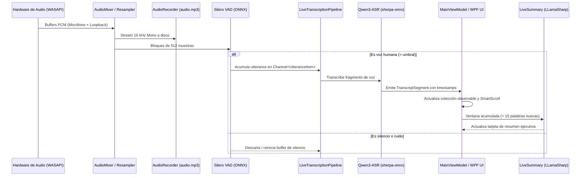

# DictaMeeting 🎙 — Guía del Desarrollador y Referencia Técnica

**[🇪🇸 Español](DEVELOPER_GUIDE.md) | [🇬🇧 English](DEVELOPER_GUIDE.en.md)**

Esta guía proporciona la documentación técnica detallada para desarrolladores, colaboradores e ingenieros de software que deseen compilar, extender o auditar **DictaMeeting**.

---

## 🛠 1. Entorno de Desarrollo y Requisitos

- **Sistema Operativo**: Windows 10 (Build 1809+) o Windows 11 x64.
- **SDK**: [.NET 9.0 SDK](https://dotnet.microsoft.com/download/dotnet/9.0) (versión x64).
- **IDE Recomendado**:
  - Visual Studio 2022 (17.12 o superior) con la carga de trabajo *Desarrollo de escritorio de .NET*.
  - Visual Studio Code con las extensiones *C# Dev Kit* y *.NET Install Tool*.
- **Herramientas Opcionales**:
  - [Inno Setup 6](https://jrsoftware.org/isdl.php) (para compilar el instalador `.exe`).
  - Git para control de versiones.

---

## 📂 2. Estructura de Proyectos y Responsabilidades

La solución `DictaMeeting.sln` se compone de 9 proyectos fuertemente desacoplados:

| Proyecto | Tipo de Proyecto | Responsabilidad Técnica |
|---|---|---|
| `DictaMeeting.Meetings` | Class Library (`net9.0`) | **Núcleo de Dominio**: Entidades (`Meeting`, `Speaker`, `TranscriptSegment`), contratos y serializadores de exportación (Markdown, TXT, JSON). Cero dependencias externas. |
| `DictaMeeting.Audio` | Class Library (`net9.0-windows`) | **Captura y Mezcla**: Servicios WASAPI con NAudio, captura dual (micrófono + loopback), resampleo a 16 kHz mono, limitador suave y vúmetros. |
| `DictaMeeting.Transcription` | Class Library (`net9.0-windows`) | **Motores ASR y VAD**: Implementaciones de Silero VAD v5, Qwen3-ASR (`sherpa-onnx`), Whisper (`Whisper.net`), gestores de descarga de modelos y motor de puntuación ONNX. |
| `DictaMeeting.Diarization` | Class Library (`net9.0-windows`) | **Diarización de Hablantes**: Extracción de características acústicas, clustering en tiempo real, diarización offline y reconciliador de speakers (`SpeakerReconciler`). |
| `DictaMeeting.AI` | Class Library (`net9.0-windows`) | **Servicios de IA**: Cliente HTTP para OpenRouter y servidores OpenAI-compatibles, generador de actas y motor local embebido de resumen en vivo vía `LLamaSharp` / `llama.cpp`. |
| `DictaMeeting.Infrastructure` | Class Library (`net9.0-windows`) | **Infraestructura y Seguridad**: Cifrado con Windows DPAPI (`ProtectedData`), repositorio de reuniones en disco y persistencia de configuración del usuario. |
| `DictaMeeting.Launcher` | WinExe C++ / Win32 (`net9.0-windows`) | **Lanzador Nativo**: Proceso ligero Win32 que inicia la aplicación sin abrir una consola CMD/PowerShell no deseada. |
| `DictaMeeting.App` | WPF Application (`net9.0-windows`) | **Interfaz de Usuario**: Vistas XAML, ViewModels con `CommunityToolkit.Mvvm`, host de inyección de dependencias, estilos modernos obsidian y sistema i18n reactivo. |
| `DictaMeeting.Tests` | xUnit Test Project (`net9.0-windows`) | **Suite de Pruebas**: Tests unitarios y de integración para todas las capas de la aplicación. |

---

## 🏗 3. Contratos de Servicios Principales

Todos los subsistemas se registran en el contenedor de inyección de dependencias (`IServiceCollection`) en `DictaMeeting.App/App.xaml.cs`:

### Audio (`DictaMeeting.Audio`)
- `IAudioCaptureService`: Inicia, pausa y detiene la captura de streams WASAPI de micrófono y bucle invertido.
- `IAudioDeviceService`: Enumera dispositivos de entrada y salida disponibles en Windows y detecta desconexiones en caliente.
- `IAudioMixerService`: Combina los dos canales de 16-bit PCM flotante, aplica nivelación y evita saturación mediante compresión suave.
- `IAudioRecorderService`: Codifica el stream mezclado en `audio.mp3` utilizando el codificador nativo de Windows Media Foundation.

### Transcripción y VAD (`DictaMeeting.Transcription`)
- `ITranscriptionService`: Abstracción principal de reconocimiento de voz. Métodos clave:
  - `TranscribeAudioChunkAsync(float[] samples, CancellationToken ct)`: Transcripción en vivo por fragmentos.
  - `TranscribeAudioFileAsync(string audioFilePath, ...)`: Transcripción definitiva por lotes sobre el archivo de audio completo.
- `IVoiceActivityDetector`: Analiza bloques PCM de 512 muestras y devuelve la probabilidad de voz humana (`0.0` a `1.0`).
- `IPunctuationService`: Restaura comas, puntos y mayúsculas en transcripciones generadas por motores sin puntuación.
- `IModelManager`: Gestiona el catálogo de modelos, comprueba sumas SHA256 y descarga modelos con reporte porcentual.

### Diarización (`DictaMeeting.Diarization`)
- `IDiarizationService`: Agrupa acústicamente las intervenciones y asigna identificadores de speaker (`SPEAKER_00`, `SPEAKER_01`).
- `ISpeakerReconciler`: Al finalizar la reunión, cruza los nombres asignados en la UI con los clusters del audio consolidado usando solapamiento temporal.

### Inteligencia Artificial (`DictaMeeting.AI`)
- `IAiActaService`: Conecta con OpenRouter o pasarelas locales (Ollama, LiteLLM) para generar actas ejecutivas estructuradas.
- `ILiveSummaryService`: Ejecuta inferencia periódica local sobre ventanas de texto de 60–90 segundos utilizando `llama.cpp` y el modelo `Qwen2.5-1.5B-Instruct-Q4_K_M.gguf`.

### Seguridad e Infraestructura (`DictaMeeting.Infrastructure`)
- `ISecureStorageService`: Cifra y descifra cadenas sensibles mediante Windows DPAPI (`DataProtectionScope.CurrentUser`).
- `IMeetingRepository`: Guarda y recupera sesiones en disco (`meeting.json`, `transcript.md`, `transcript.txt`).

---

## 🔄 4. Flujo de Datos y Concurrencia

El procesamiento durante una reunión sigue una arquitectura de canales asíncronos desacoplados (`System.Threading.Channels`):



### Reglas de Prioridad de Hilos
1. **Prioridad Alta**: Los buffers WASAPI y el remuestreo operan en hilos de audio dedicados en tiempo real para evitar pérdidas de muestras (*glitches*).
2. **Prioridad Normal**: La transcripción ASR consume el canal asíncrono en segundo plano (`Task.Run`).
3. **Prioridad Baja (Throttled)**: La inferencia del LLM local de resumen se limita a `Environment.ProcessorCount / 2` (máximo 4 hilos) para que la inferencia de lenguaje no reste CPU al audio ni al ASR.

---

## 🌐 5. Sistema de Internacionalización (i18n)

DictaMeeting implementa un sistema reactivo de localización bilingüe (**Español** e **Inglés**) que no requiere reiniciar la aplicación:

### Estructura de Recursos
- `src/DictaMeeting.App/Resources/Strings.resx`: Recurso neutro de reserva (fallback).
- `src/DictaMeeting.App/Resources/Strings.es.resx`: Cadenas en Español.
- `src/DictaMeeting.App/Resources/Strings.en.resx`: Cadenas en Inglés.

### Cómo Usar Localización en XAML
Usa la extensión personalizada `{loc:Loc KeyName}`:
```xml
<TextBlock Text="{loc:Loc Meeting_StartButton}" />
<Button ToolTip="{loc:Loc Meeting_Title_Save_Tooltip}" />
```

### Cómo Usar Localización en C#
Inyecta `LocalizationManager` o usa los métodos de ayuda en los ViewModels:
```csharp
// Obtener una cadena simple:
string title = _localizationManager.GetString("Dialog_Error_Title");

// Formatear cadenas compuestas con parámetros:
string message = _localizationManager.GetStringFormatted("Meeting_Exported_Success", filePath);
```

### Cómo Añadir una Nueva Cadena
1. Añade la entrada en `Strings.resx`.
2. Añade la traducción en `Strings.es.resx` y `Strings.en.resx`.
3. Ejecuta las pruebas de localización (`LocalizationManagerTests.cs`) para verificar consistencia.

---

## 🔒 6. Seguridad y Almacenamiento Seguro (Windows DPAPI)

Las API Keys de OpenRouter y servidores de inferencia se protegen mediante la Windows Data Protection API:

```csharp
byte[] encrypted = ProtectedData.Protect(
    Encoding.UTF8.GetBytes(apiKey),
    optionalEntropy: null,
    scope: DataProtectionScope.CurrentUser
);
```

- **Ámbito `CurrentUser`**: La clave de cifrado está ligada criptográficamente al inicio de sesión del usuario en Windows.
- Ninguna otra cuenta de usuario de la máquina, ni procesos de otros usuarios, pueden descifrar las credenciales.
- Nunca se almacenan claves en texto plano en `appsettings.json`, ni en variables de entorno fijas, ni en repositorios.

---

## 🧪 7. Compilación, Pruebas y CI/CD

### Compilación desde CLI
```powershell
# Restaurar dependencias
dotnet restore

# Compilar en modo Release
dotnet build -c Release
```

### Ejecución de Pruebas Automatizadas
La suite de pruebas contiene cerca de 400 tests unitarios y de integración con xUnit:
```powershell
dotnet test
```

> [!NOTE]
> Las pruebas unitarias están desacopladas de descargas de modelos externos. Cualquier prueba que requiera modelos locales pesados ejecuta un `Assert.Skip(...)` limpio si no están descargados localmente, garantizando que los tests pasen al 100% en entornos CI/CD sin conectividad externa.

### Generación de Distribución y Paquete de Instalador
```powershell
# Genera dist/publish-win-x64, el paquete .zip portable y el instalador Inno Setup (.exe)
.\scripts\build-distribution.ps1 -Configuration Release -Runtime win-x64
```
Los artefactos se depositan en el directorio `dist/`:
- `dist/DictaMeeting-v1.5.4-win-x64-portable.zip`
- `dist/installer/DictaMeeting-v1.5.4-Setup.exe`
